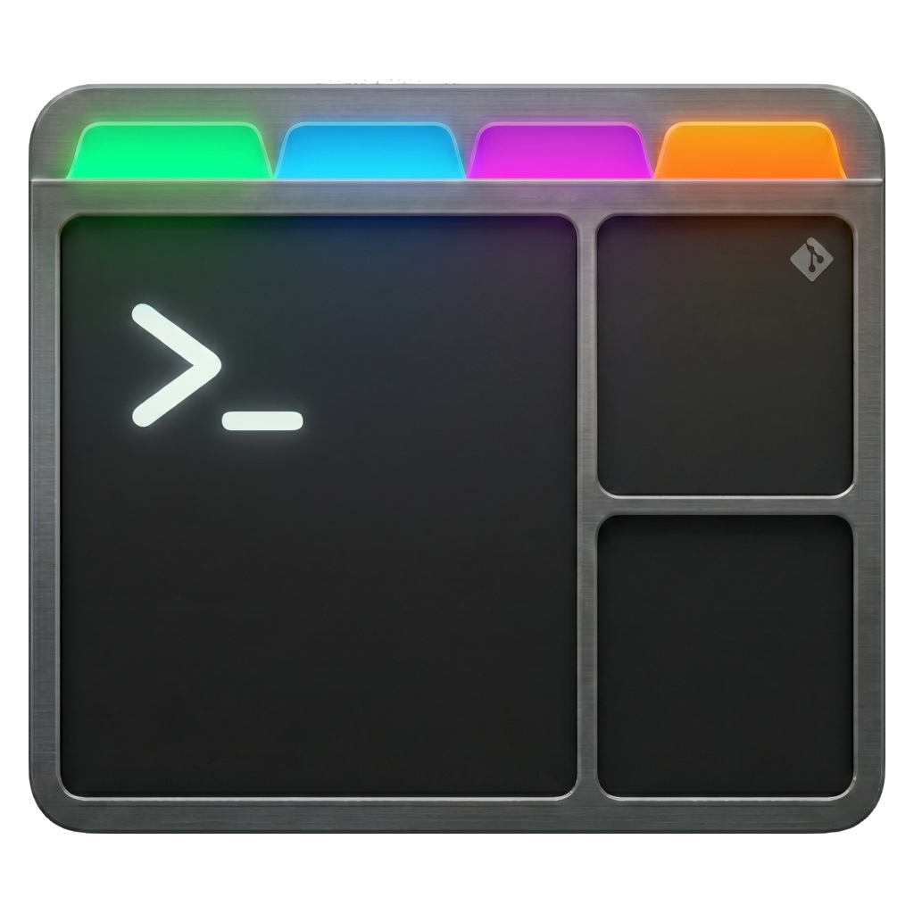

<h1 align="center">Tmiix</h1>
<div align="center">
  <p>The missing tmux GUI</p>
  
</div>

Tmiix manages local and remote [tmux](https://github.com/tmux/tmux) sessions in a beautiful, intuitive, fast UI.

[](https://github.com/nonbili/tmiix/releases/latest)

## Features

- Manage tmux sessions on local and SSH servers
- Paste clipboard image directly into AI coding agent on SSH servers
- Keyboard shortcuts to quickly switch sessions
- Fully customizable

## Screenshots

_(Coming soon)_

## Development

Required: Go, [Bun](https://bun.sh/), and the [Wails CLI](https://wails.io/docs/gettingstarted/installation).

Run live development mode with:

```sh
wails dev
```

## Build

Build the production desktop app:

```sh
wails build
```

The resulting binary will be in `build/bin/`.
